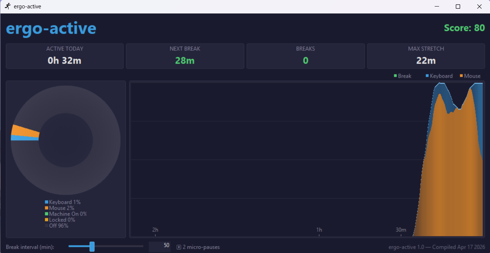

# ErgoActive

A native Win32 C++ desktop application that monitors keyboard and mouse activity and reminds you to take regular breaks. It runs in the system tray, tracks your input over a rolling window, detects 3-minute idle breaks, and shows balloon notifications when you've been working too long without a rest.

## Features

### Only uses about 2mb of ram and almost no CPU.

### Activity Monitoring
- Tracks keyboard and mouse activity in real time via `GetLastInputInfo` — no hooks or drivers required
- Distinguishes keyboard vs. mouse input for per-device activity breakdown
- Rolling-window activity graph with gradient fills, keyboard/mouse split, break markers, and labeled time axis
- Detects 3-minute idle periods as micro-breaks

### Break Reminders
- Configurable break-warning interval (20–120 minutes via slider)
- Color-coded urgency: system tray icon shifts green → yellow → red as you approach and exceed the limit
- Balloon notifications with break reminders and rotating posture/ergonomic tips
- 20-20-20 eye-strain rule: reminds you to look 20 feet away for 20 seconds every 20 minutes of continuous use

### Dashboard
- Dark-themed window with stat cards: active time, next break countdown, breaks taken, longest stretch, and daily ergonomic score (0–100)
- Real-time activity graph showing the last hour of keyboard and mouse usage
- Per-monitor DPI awareness (PerMonitorV2) for crisp rendering on any display

### Daily History
- Persists per-day statistics (active minutes, break count, longest stretch, score, keyboard/mouse/idle/locked ticks) to `%APPDATA%\ergo-active\history.csv`
- Retains up to 30 days of history
- Ergonomic score rewards regular breaks and penalizes long unbroken stretches

### System Tray
- Runs quietly in the system tray with a dynamic color-coded icon
- Live tooltip showing current status
- Context menu for quick access
- Automatically recovers the tray icon if Explorer restarts

## License

[CC0 1.0 Universal](LICENSE) — public domain.
