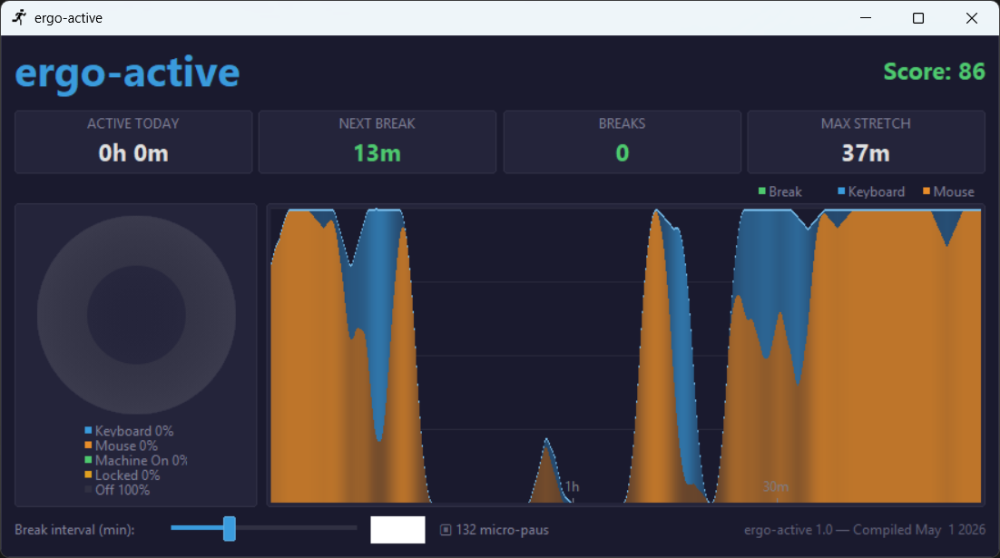

# ergo-active

[](https://github.com/ZacWalk/ergo-active/actions/workflows/build.yml)

A native Win32 C++ desktop application that monitors keyboard and mouse activity and reminds you to take regular breaks. It runs in the system tray, tracks your input over a rolling window, detects 3-minute idle breaks, and shows balloon notifications when you've been working too long without a rest.



## Features

### Only uses about 2mb of ram and almost no CPU.

### Activity Monitoring
- Tracks keyboard and mouse activity in real time via `GetLastInputInfo` — no hooks or drivers required
- Distinguishes keyboard vs. mouse input for per-device activity breakdown
- Rolling-window activity graph with a keyboard/mouse split, shaded break bands, and a labeled time axis
- Counts ~20-second micro-pauses as well as full 3-minute breaks
- A locked session counts as time away from the keyboard, so locking your PC accrues toward a break

### Break Reminders
- Configurable break interval (20–120 minutes via slider or the number box)
- Color-coded urgency: the tray icon shifts green → yellow → red as you approach and exceed the limit
- Balloon notifications with break reminders and rotating posture/ergonomic tips
- 20-20-20 eye-strain rule: reminds you to look 20 feet away for 20 seconds every 20 minutes of continuous use, yielding to an overdue break warning so the two never collide

### Dashboard
- Dark-themed window (including the title bar) with stat cards: active time, next break countdown, breaks taken, longest stretch, and a daily ergonomic score (0–100)
- Activity graph covering the last four hours, plus a pie chart breaking the day into keyboard, mouse, machine-on, locked and off time
- Per-monitor DPI awareness (PerMonitorV2) for crisp rendering on any display

### Daily History
- Persists per-day statistics to `%APPDATA%\ergo-active\history.csv` (active minutes, breaks, longest stretch, score, micro-pauses, and keyboard/mouse/idle/locked ticks)
- Retains up to 30 days of history; the rolling activity window survives restarts in `%APPDATA%\ergo-active\usage.dat`
- Data is flushed every five minutes as well as on exit and at Windows shutdown
- The ergonomic score is measured against *your* configured break interval, rewarding regular breaks and penalizing long unbroken stretches

### System Tray
- Runs quietly in the system tray with a dynamic color-coded icon
- Live tooltip showing time to the next break (or how overdue you are) and today's score
- Context menu for quick access; closing the window offers Hide or Exit
- Only one instance runs at a time — launching again surfaces the window that is already running
- Automatically recovers the tray icon if Explorer restarts

## Building

Requires Visual Studio with the C++ desktop workload. The tree is warning-clean at `/W4`.

```powershell
.\dd.ps1 run      # build Release x64 and launch it
.\dd.ps1 build    # build only
```

`dd.ps1` also accepts `-Configuration Debug` and `-Platform Win32`. Alternatively open `ergo-active.sln`, or build from the command line:

```powershell
msbuild ergo-active.sln /p:Configuration=Release /p:Platform=x64 /m
```

Binaries are written to `Exe\ergo-active-{32|64}[d].exe`.

## License

[CC0 1.0 Universal](LICENSE) — public domain.
